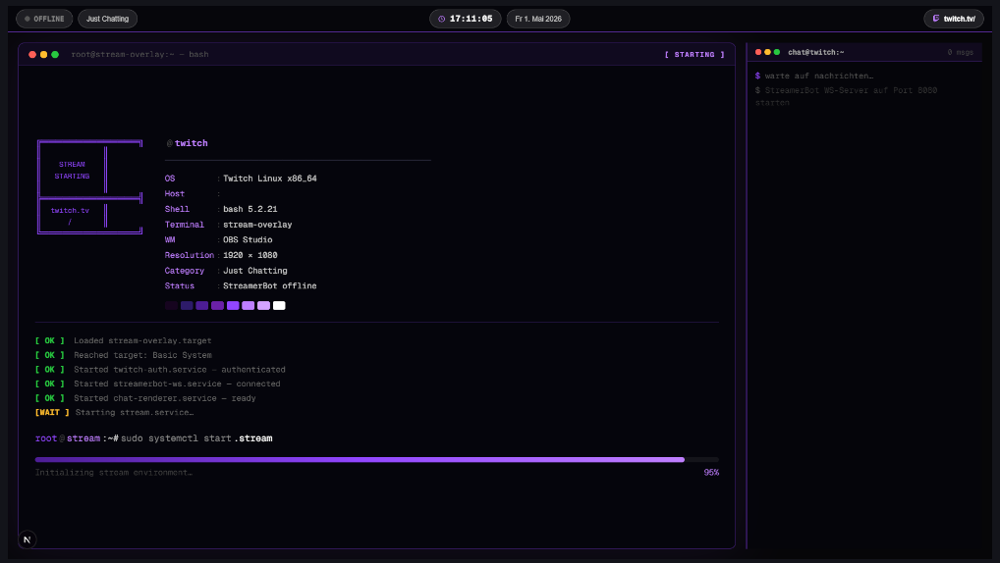

# 🖥️ Stream Overlay




Ein anpassbares Twitch-Overlay für OBS im **Linux-Terminal-/Tiling-WM-Stil** (Waybar, Sway, i3).  
Gebaut mit **Next.js 16**, **StreamerBot WebSocket** und der **Twitch Helix API**.

> [!NOTE]
> **Dieses Projekt ist ein persönlicher Experiment für meinen Twitch-Kanal** — kein ernsthaftes Open-Source-Vorhaben.  
> Es wurde größtenteils gemeinsam mit einer KI entwickelt, um zu testen ob und wie gut so ein Overlay-System  
> mit diesem Tech-Stack funktioniert. Der Code ist öffentlich, falls jemand daraus etwas lernen oder  
> es als Ausgangspunkt nutzen möchte — aber es gibt keine Garantien auf Support oder aktive Weiterentwicklung.

---

## ✨ Features

| Overlay / Screen    | URL                        | Beschreibung                              |
| ------------------- | -------------------------- | ----------------------------------------- |
| **Just Chatting**   | `/overlay/just-chatting`   | Webcam fullscreen + Chat rechts + TopBar  |
| **TopBar Only**     | `/overlay/topbar-only`     | Nur die Statusleiste – für Ingame/Desktop |
| **Stream Starting** | `/overlay/stream-starting` | Boot-Screen mit Neofetch-Layout + Chat    |
| **AFK**             | `/overlay/afk`             | "Gleich geht es weiter" + Uhr + Chat      |

**TopBar zeigt:**

- 🔴 LIVE / OFFLINE Indikator (StreamerBot-Verbindung)
- Aktuelle Twitch-Kategorie
- Uhrzeit & Datum
- Zuschauerzahl
- Stream-Uptime
- `twitch.tv/<deinKanal>`

**Chat** im Shell-Prompt-Stil: `@Username@twitch:~$ Nachricht`

---

## 📋 Voraussetzungen

| Software                            | Version  | Wozu                                   |
| ----------------------------------- | -------- | -------------------------------------- |
| [Node.js](https://nodejs.org)       | ≥ 20 LTS | Läuft die App                          |
| [StreamerBot](https://streamer.bot) | beliebig | Liefert Chat & Events per WebSocket    |
| Twitch Developer App                | –        | OAuth-Token für Zuschauerzahl & Uptime |

> **StreamerBot-Einrichtung:** WebSocket-Server in StreamerBot aktivieren (`Servers/Clients → WebSocket Server → Auto Start`). Standard: `ws://127.0.0.1:8080`.

---

## 🚀 Schnellstart (empfohlen)

> Für die meisten Streamer ist dies der einfachste Weg — kein Docker, kein Overhead.

```bash
# 1. Repository klonen
git clone https://github.com/DEIN_NAME/stream-overlay.git
cd stream-overlay

# 2. Abhängigkeiten installieren
npm install

# 3. Konfigurationsdatei anlegen
cp .env.local.example .env.local
```

Öffne `.env.local` und trage mindestens diese Werte ein:

```env
TWITCH_CLIENT_ID=deine_client_id
TWITCH_CLIENT_SECRET=dein_client_secret
NEXT_PUBLIC_CHANNEL_NAME=deinKanalname
TWITCH_CHANNEL_LOGIN=deinKanalname
```

```bash
# 4. Produktions-Build erstellen & starten
npm run build
npm start
# → http://localhost:3000
```

> Für Entwicklung statt `npm run build && npm start` einfach `npm run dev` nutzen — dann gibt es Hot-Reload.

---

## 🔑 Twitch App einrichten

1. Gehe zu [dev.twitch.tv/console/apps](https://dev.twitch.tv/console/apps) → **Neue App erstellen**
2. **OAuth Redirect URL:** `http://localhost:3000/api/auth/twitch/callback`  
   _(Bei Remote-Setup: URL aus `NEXT_PUBLIC_APP_URL`)_
3. Client ID und Client Secret kopieren → in `.env.local` eintragen
4. Im Browser: `http://localhost:3000/setup` → **Mit Twitch verbinden**

Der Token wird serverseitig in `data/auth.json` gespeichert und überlebt Neustarts.

---

## 📺 OBS Browser-Source einrichten

Für jedes Overlay eine **Browser-Source** in OBS anlegen:

### Just Chatting

| Einstellung               | Wert                                          |
| ------------------------- | --------------------------------------------- |
| URL                       | `http://localhost:3000/overlay/just-chatting` |
| Breite                    | `1920`                                        |
| Höhe                      | `1080`                                        |
| Transparentes Hintergrund | ✅                                            |

### TopBar Only

| Einstellung               | Wert                                        |
| ------------------------- | ------------------------------------------- |
| URL                       | `http://localhost:3000/overlay/topbar-only` |
| Breite                    | `1920`                                      |
| Höhe                      | `52`                                        |
| Transparentes Hintergrund | ✅                                          |

### Stream Starting

| Einstellung               | Wert                                            |
| ------------------------- | ----------------------------------------------- |
| URL                       | `http://localhost:3000/overlay/stream-starting` |
| Breite                    | `1920`                                          |
| Höhe                      | `1080`                                          |
| Transparentes Hintergrund | ❌ (hat eigenen Hintergrund)                    |

### AFK

| Einstellung               | Wert                                |
| ------------------------- | ----------------------------------- |
| URL                       | `http://localhost:3000/overlay/afk` |
| Breite                    | `1920`                              |
| Höhe                      | `1080`                              |
| Transparentes Hintergrund | ❌ (hat eigenen Hintergrund)        |

> **Tipp:** In OBS unter `Werkzeuge → Browser-Quellen-Cache leeren` nach Updates.

---

## ⚙️ Alle Umgebungsvariablen

| Variable                       | Pflicht | Standard                | Beschreibung                                      |
| ------------------------------ | ------- | ----------------------- | ------------------------------------------------- |
| `TWITCH_CLIENT_ID`             | ✅      | –                       | Twitch App Client ID                              |
| `TWITCH_CLIENT_SECRET`         | ✅      | –                       | Twitch App Client Secret                          |
| `NEXT_PUBLIC_CHANNEL_NAME`     | ✅      | –                       | Kanalname für Overlay-Anzeige (z. B. `MeinKanal`) |
| `TWITCH_CHANNEL_LOGIN`         | ✅      | –                       | Kanalname für Twitch API (Kleinschreibung)        |
| `NEXT_PUBLIC_APP_URL`          | –       | `http://localhost:3000` | Öffentliche URL der App                           |
| `NEXT_PUBLIC_STREAMERBOT_HOST` | –       | `127.0.0.1`             | StreamerBot WebSocket Host                        |
| `NEXT_PUBLIC_STREAMERBOT_PORT` | –       | `8080`                  | StreamerBot WebSocket Port                        |

> ⚠️ **`NEXT_PUBLIC_*` Variablen** werden zur **Build-Zeit** in den Client-Code eingebacken. Nach einer Änderung muss die App neu gebaut werden (`npm run build` oder `docker compose build --no-cache`).

---

## 🐳 Docker (Fortgeschritten)

> Docker eignet sich besonders, wenn du das Overlay auf einem **separaten Gerät** (NAS, Homeserver, zweiter PC) betreiben willst, sodass es unabhängig vom Gaming-PC läuft.
>
> Für lokale Setups ist der [Schnellstart](#-schnellstart-empfohlen) mit npm einfacher.

### Warum Docker hier etwas tricky ist

`NEXT_PUBLIC_*` Variablen werden **beim Build** in das JavaScript eingebacken — der Docker-Container muss also mit den richtigen Werten gebaut werden. Außerdem muss der Container den StreamerBot-WebSocket-Server auf dem **Host-PC** erreichen.

### Anleitung

```bash
# 1. .env.local anlegen
cp .env.local.example .env.local
# → Alle Werte ausfüllen (siehe Tabelle oben)

# 2. Image bauen & Container starten
docker compose up --build

# 3. Setup öffnen
# → http://localhost:3000/setup → Mit Twitch verbinden
```

### StreamerBot aus dem Container erreichen

| Betriebssystem  | `NEXT_PUBLIC_STREAMERBOT_HOST` in `.env.local`            |
| --------------- | --------------------------------------------------------- |
| Windows / macOS | `host.docker.internal` _(Standard in docker-compose.yml)_ |
| Linux           | `172.17.0.1` oder eigene Docker-Bridge-IP                 |

### Nach Konfigurationsänderungen

```bash
# NEXT_PUBLIC_* geändert → Image neu bauen
docker compose build --no-cache
docker compose up

# Nur Server-Secrets (TWITCH_CLIENT_*) geändert → Nur Neustart nötig
docker compose restart
```

### Daten

Token und Stream-State werden im Docker-Volume `overlay-data` gespeichert (`/app/data` im Container). Das Volume überlebt Neustarts und Rebuilds.

---

## 🗂️ Projektstruktur

```
stream-overlay/
├── app/
│   ├── api/                    # Route Handler: Auth, Stream-Info, Stream-State
│   ├── components/overlay/     # Wiederverwendbare Overlay-Komponenten
│   │   ├── StreamerbotContext  # WebSocket & globaler State (Context)
│   │   ├── TopBar              # Waybar-style Statusleiste
│   │   ├── ChatPanel           # Chat-Fenster mit Terminal-Header
│   │   └── ChatMessage         # Shell-Prompt-formatierte Nachrichten
│   ├── overlay/                # OBS Browser-Source Seiten
│   │   ├── just-chatting/
│   │   ├── topbar-only/
│   │   ├── stream-starting/
│   │   └── afk/
│   └── setup/                  # Twitch OAuth Setup-Seite
├── lib/
│   └── server-state.ts         # Datei-basierte Persistenz (data/*.json)
├── data/                       # Laufzeit-Daten (in .gitignore)
│   ├── auth.json               # Twitch Tokens
│   └── stream-state.json       # Letzter bekannter Stream-State
├── .env.local.example          # Vorlage für Konfiguration
├── Dockerfile
├── docker-compose.yml
└── CONTRIBUTING.md
```

---

## 🤝 Mitwirken

Contributions sind willkommen! Lies bitte [CONTRIBUTING.md](CONTRIBUTING.md) bevor du einen PR öffnest.

- 🐛 **Bug gefunden?** → [Issue erstellen](https://github.com/jalumu/itsLvky-Stream-Overlay/issues)
- 🔧 **Code beitragen?** → Fork → Branch → PR

---

## 📄 Lizenz

[MIT](LICENSE) — frei nutzbar, auch für kommerzielle Streams.
